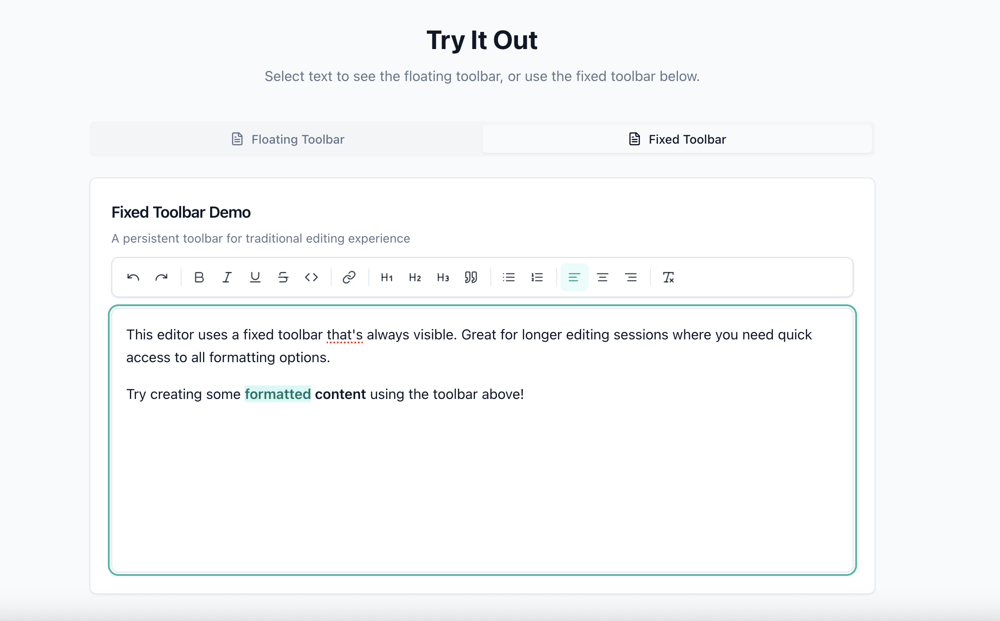
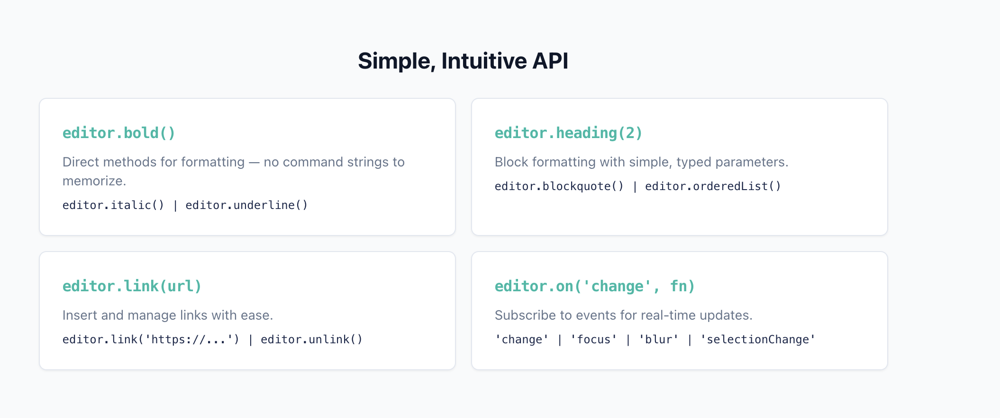
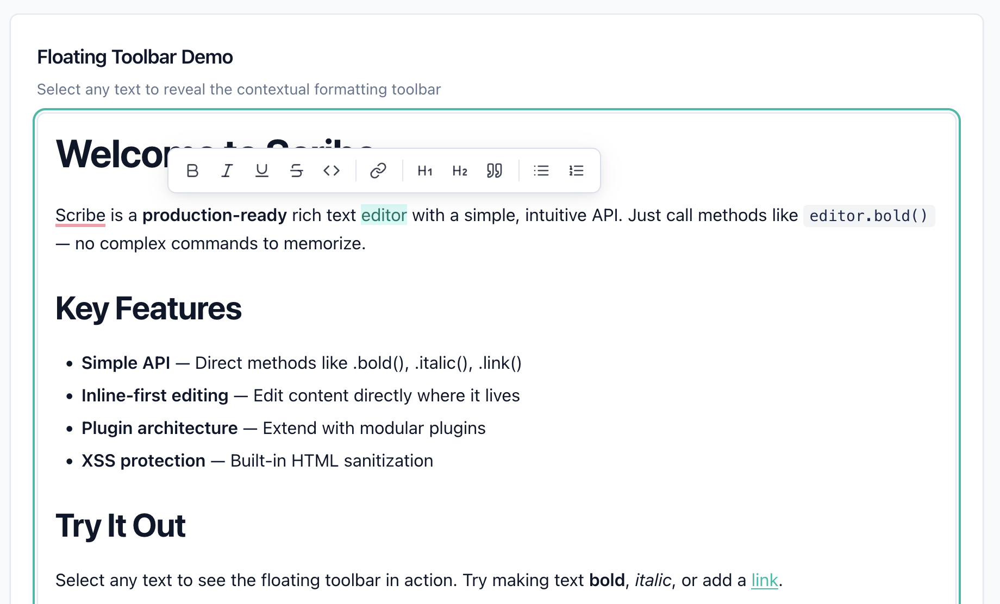
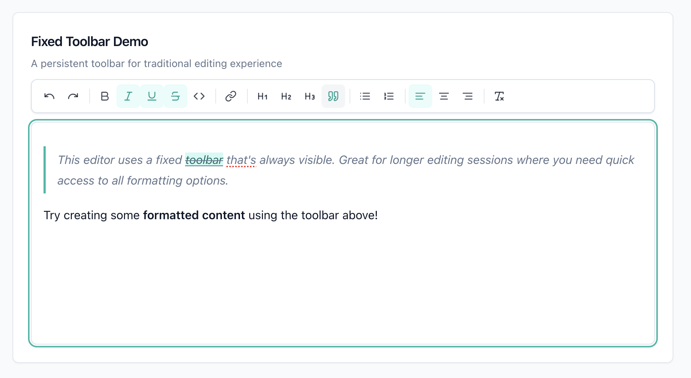

# Scribe Editor

<p align="center">
  
</p>

Lightweight rich-text editor core with a modern demo UI, fixed toolbar workflow, and a minimal API.

Website: https://scribejs.top

## Table of contents

- [Features](#features)
- [Screenshots](#screenshots)
- [Download](#download)
- [Usage](#usage)
- [Development](#development)
- [Documentation](#documentation)
- [API](#api)
- [Plugins](#plugins)
- [Support](#support)
- [License](#license)

## Features

- Inline-first editing with a fixed toolbar experience.
- Simple, typed API with direct method calls.
- Built-in HTML sanitization and safe paste handling.
- Extensible plugin architecture.
- Framework-agnostic core for integration anywhere.

## Screenshots

| Hero | Fixed Toolbar | Quick Start |
| --- | --- | --- |
|  |  |  |

## Download

- NPM: `npm i scribejs-editor`
- Git: `git clone https://github.com/GoodPHP/scribejs`

## Usage

```ts
import { createEditor } from 'scribejs-editor';

const editor = createEditor({
  target: '#editor',
  placeholder: 'Start typing...'
});

editor.bold();
editor.link('https://example.com');

const html = editor.getHTML();
```

## Development

```bash
npm install
npm run dev
```

When the dev server starts, it prints the local URL to open the demo.

## Documentation

- Demo UI: index.html + public/demo.css + public/demo.js
- Build output: dist/index.js (browser ESM)
- Types: types/index.d.ts
- Source: src/

## API

Common editor methods used in the demo:

- `editor.bold()` / `editor.italic()` / `editor.underline()`
- `editor.heading(1 | 2 | 3)` / `editor.paragraph()` / `editor.blockquote()`
- `editor.orderedList()` / `editor.unorderedList()`
- `editor.link(url)` / `editor.unlink()`
- `editor.setFontSize(size)` / `editor.setFontFamily(family)`
- `editor.setColor(color)` / `editor.setBackgroundColor(color)`
- `editor.getHTML()` / `editor.getText()` / `editor.isEmpty()`

## Plugins

Scribe is built with a plugin-first architecture. Add only what you need and keep bundles lean.

- Built-in plugins live in src/plugins/
- External plugins can wrap common behaviors (toolbars, history, selection helpers)

## Support

If you use Scribe in production, consider sharing feedback or contributing improvements.

## License

BSD-3-Clause
